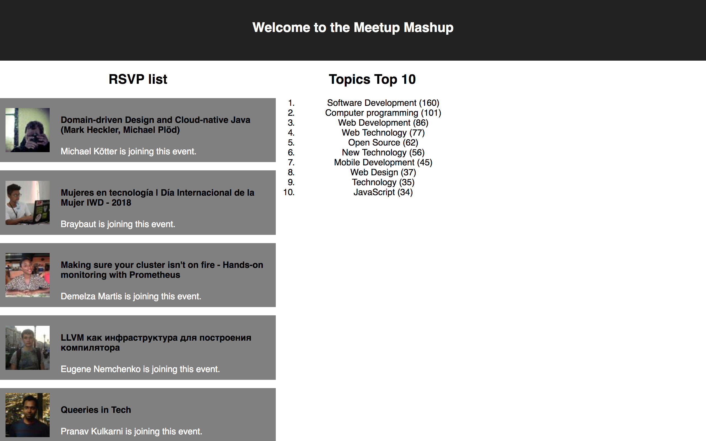

# Meetup Mashup

Express app made during week 5-6 of the 9-week Codaisseur Academy. The frontend for this app can be found [here](https://github.com/Abohte/meetup-client).

This app, that streams RSVP's with the 'Software Development' topic from Meetup.com, was built as an exercise to get to know Socket.IO.

<kbd>
  
</kbd>

## Steps

While working on this app I followed these steps:

1. Setting up a server with WebSocket connection.
2. Filtering based on topics.
3. Emitting events.
4. Setting up a React frontend with Redux.
5. Connect to server.

## Running Locally

Make sure you have [Node.js](https://nodejs.org/en/) and [Yarn](https://yarnpkg.com/lang/en/) installed.

```bash
git clone git@github.com:Abohte/meetup-server.git
cd meetup-server
yarn install
node .
```

Then get the [frontend](https://github.com/Abohte/meetup-client) up.
